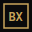
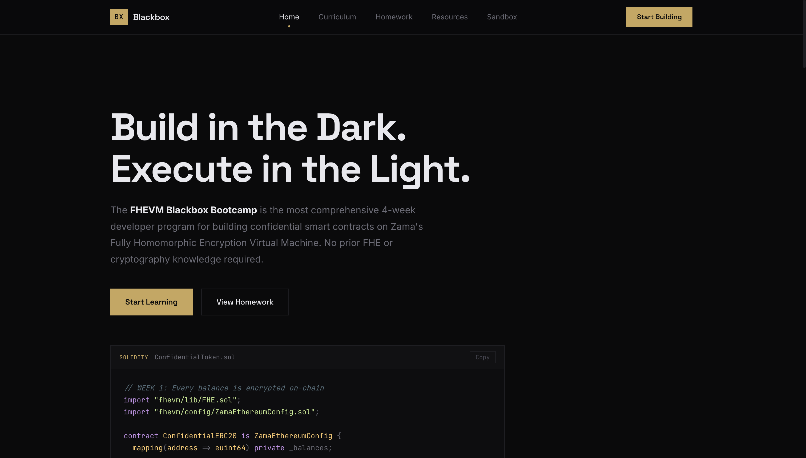

<p align="center">
  
</p>

<h1 align="center">Blackbox Bootcamp</h1>

<p align="center">
  <strong>The interactive learning platform for Fully Homomorphic Encryption on Ethereum</strong>
</p>

<p align="center">
  <a href="https://blackbox-bootcamp.vercel.app">Live Demo</a> &nbsp;&middot;&nbsp;
  <a href="https://docs.zama.ai/fhevm">Zama FHEVM Docs</a> &nbsp;&middot;&nbsp;
  <a href="https://github.com/zama-ai/fhevm-hardhat-template">FHEVM Template</a>
</p>

---

<p align="center">
  
</p>

---

## Why FHE Matters

Today's smart contracts have a fundamental flaw: **everything is public**. When you transfer tokens, everyone sees the amount. When you place a bid, competitors see your strategy. When you vote, the world knows your choice before the poll closes.

This isn't just an inconvenience — it actively prevents entire categories of applications from existing on-chain:

- **DeFi** — Front-runners exploit visible pending transactions, costing users billions annually
- **Governance** — Public votes create social pressure and enable vote-buying
- **Auctions** — Open bids let participants game the system
- **Payroll** — Salary data can't be stored on a transparent ledger
- **Healthcare** — Patient records are incompatible with public blockchains

**Fully Homomorphic Encryption (FHE)** solves this at the protocol level. It allows smart contracts to compute directly on encrypted data — additions, comparisons, conditionals — without ever decrypting it. Not validators, not node operators, not MEV bots. Nobody sees the underlying values.

This means you can write a token contract where balances are invisible, an auction where bids are sealed until reveal, or a voting system where individual votes are hidden but the final tally is provably correct. All on-chain, all trustless, all private.

[Zama's FHEVM](https://docs.zama.ai/fhevm) brings this to Ethereum with a Solidity-native API. You write `FHE.add(a, b)` instead of `a + b`, and the computation happens on ciphertext. That's the paradigm shift this bootcamp teaches.

## The Solution

Blackbox Bootcamp is a structured, hands-on learning platform that takes developers from zero FHE knowledge to building production-ready encrypted smart contracts using [Zama's FHEVM](https://docs.zama.ai/fhevm).

No slides. No passive video lectures. Every concept is taught through interactive content, quizzes, and a live coding sandbox.

## Features

### Interactive Curriculum
13 lessons across 4 weeks with expandable content, inline code examples with syntax highlighting, quizzes with instant feedback, and per-lesson progress tracking.

### FHE Coding Sandbox
10 progressive coding exercises in a full IDE-style interface — file explorer sidebar, syntax-highlighted editor, terminal-style output panel, and pattern-based code validation. Exercises range from declaring encrypted types to building blind auction logic.

### Homework & Starter Code
Weekly assignments with Solidity starter templates, detailed grading rubrics, difficulty progression, and pro tips for each task.

### Resource Hub
Three-tab resource center with learning materials (FHE type system reference, cheat sheets, glossary), an instructor guide (common mistakes, cohort tips), and a video production guide.

### Progress System
localStorage-based completion tracking across curriculum lessons and sandbox exercises. Visual progress indicators in the navbar, sidebar, and dedicated progress bars. Animated celebrations on completion.

## Curriculum

| Week | Topic | What You Learn |
|------|-------|----------------|
| **01** | FHE Foundations | Encrypted types (`euint64`, `ebool`), `FHE.add`/`sub`, input validation with `FHE.fromExternal`, ACL permissions with `FHE.allow`/`allowThis` |
| **02** | Building Blocks | Boolean masking with `FHE.and`/`FHE.or`, comparison operators, `FHE.select` for branchless logic, encrypted DeFi patterns (dark pools, AMMs) |
| **03** | Real Applications | Blind auctions, sealed voting, public decryption with `FHE.makePubliclyDecryptable`, Relayer SDK client integration |
| **04** | Production Patterns | Gas optimization (selective encryption), cross-contract ACL handoff, testing strategies, deployment best practices |

## Sandbox Exercises

| # | Exercise | Difficulty | Concept |
|---|----------|------------|---------|
| 01 | Declare Encrypted Storage | Beginner | `euint64`, `ebool` type declarations |
| 02 | Accept Encrypted Input | Beginner | `externalEuint64`, `FHE.fromExternal` |
| 03 | The No-Revert Transfer | Intermediate | `FHE.le`, `FHE.select` for silent no-ops |
| 04 | Boolean Masking | Intermediate | Chaining `FHE.and` for multi-condition logic |
| 05 | Constant-Product Swap | Intermediate | `FHE.mul`, `FHE.div` for encrypted AMM math |
| 06 | Sealed Bid | Advanced | Blind auction with `FHE.gt` + `FHE.select` |
| 07 | Public Decryption | Advanced | `FHE.makePubliclyDecryptable` for reveals |
| 08 | Cross-Contract ACL | Advanced | `FHE.allow` for inter-contract handle passing |
| 09 | Selective Encryption | Advanced | Gas optimization — encrypt only what needs privacy |
| 10 | Relayer SDK Integration | Expert | Client-side `createInstance`, `createEncryptedInput`, `encrypt` |

## Tech Stack

| Layer | Technology |
|-------|-----------|
| Framework | React 19 |
| Build | Vite 5 |
| Routing | React Router 7 |
| Styling | Custom CSS design system (no UI libraries) |
| State | React Context + localStorage |
| Hosting | Vercel |
| Backend | None — fully static SPA |

## Design

The UI follows "The Vault" design concept — a dark, minimal aesthetic built around a warm gold accent (`#C8A55A`), sharp edges (no border-radius), and restrained typography using Space Grotesk and JetBrains Mono. The signature element is the "DecryptText" animation where cipher characters resolve into readable text on scroll.

## Getting Started

```bash
# Clone
git clone https://github.com/Oshioke-Salaki/blackbox-bootcamp.git
cd blackbox-bootcamp

# Install
npm install

# Dev server
npm run dev
```

Open [http://localhost:5173](http://localhost:5173) in your browser.

### Scripts

```bash
npm run dev       # Start development server
npm run build     # Production build
npm run preview   # Preview production build
npm run lint      # Run ESLint
```

## Project Structure

```
src/
├── components/
│   ├── CodeBlock.jsx         # Syntax-highlighted code display with copy
│   ├── DecryptText.jsx       # Cipher → text scroll animation
│   ├── Footer.jsx            # Site footer with nav links
│   ├── Navbar.jsx            # Navigation bar with progress indicator
│   ├── ProgressContext.jsx   # localStorage-based progress tracking
│   └── Quiz.jsx              # Multiple choice quiz with scoring
├── pages/
│   ├── HomePage.jsx          # Landing — hero, pipeline viz, week cards
│   ├── CurriculumPage.jsx    # 13 expandable lessons with quizzes
│   ├── HomeworkPage.jsx      # Weekly assignments with starter code
│   ├── ResourcesPage.jsx     # 3-tab resource center
│   └── SandboxPage.jsx       # IDE-style coding exercises
├── App.jsx                   # Route definitions
├── main.jsx                  # Entry point + ProgressProvider
└── index.css                 # Global design system
```

## Built For

Built for [Zama](https://www.zama.ai) by the Blackbox team.

## License

MIT
